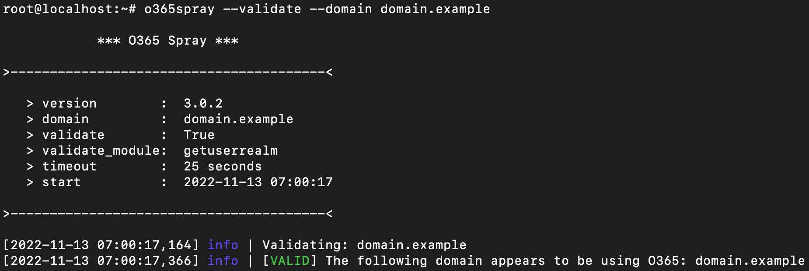

# o365spray

o365spray is a username enumeration and password spraying tool aimed at Microsoft Office 365 (O365). This tool reimplements a collection of enumeration and spray techniques researched and identified by those mentioned in [Acknowledgments](#Acknowledgments).

> For educational, authorized and/or research purposes only.

> WARNING: The Autologon, oAuth2, and RST user enumeration modules work by submitting a single authentication attempt per user. If the modules are run in conjunction with password spraying in a single execution, o365spray will automatically reset the lockout timer prior to performing the password spray -- if enumeration is run alone, the user should be aware of how many and when each authentication attempt was made and manually reset the lockout timer before performing any password spraying.

# Table of Contents

- [Usage](#usage)
- [Modules](#modules)
  - [Validation](#validation)
  - [Enumeration](#enumeration)
  - [Spraying](#spraying)
- [FireProx URLs](#fireprox-base-urls)
  - [Enumeration](#enumeration-1)
  - [Spraying](#spraying-1)
- [User Agent Randomization](#user-agent-randomization)
- [Acknowledgments](#acknowledgments)
- [Bugs](#bugs)
- [Previous Versions](#using-previous-versions)

## Usage

<h2 align="center">
  
  <br>
</h2>

Validate a domain is using O365:<br>
`o365spray --validate --domain test.com`

Perform username enumeration against a given domain:<br>
`o365spray --enum -U usernames.txt --domain test.com`

Perform password spraying against a given domain:<br>
`o365spray --spray -U usernames.txt -P passwords.txt --count 2 --lockout 5 --domain test.com`

```
usage: o365spray [flags]

o365spray | Microsoft O365 User Enumerator and Password Sprayer -- v3.1.0

options:
  -h, --help            show this help message and exit

Target:
  -d DOMAIN, --domain DOMAIN
                        Target domain for validation, user enumeration, and/or
                        password spraying.

Actions:
  --validate            Run domain validation only.

  --enum                Run username enumeration.

  --spray               Run password spraying.

Credentials:
  -u USERNAME, --username USERNAME
                        Username(s) delimited using commas.

  -p PASSWORD, --password PASSWORD
                        Password(s) delimited using commas.

  -U USERFILE, --userfile USERFILE
                        File containing list of usernames.

  -P PASSFILE, --passfile PASSFILE
                        File containing list of passwords.

  --paired PAIRED       File containing list of credentials in username:password
                        format.

Password Spraying Configuration:
  -c COUNT, --count COUNT
                        Number of password attempts to run per user before resetting
                        the lockout account timer.
                        Default: 1

  -l LOCKOUT, --lockout LOCKOUT
                        Lockout policy's reset time (in minutes).
                        Default: 15 minutes

Module Configuration:
  --validate-module VALIDATE_MODULE
                        Specify which valiadtion module to run.
                        Default: getuserrealm

  --enum-module ENUM_MODULE
                        Specify which enumeration module to run.
                        Default: office

  --spray-module SPRAY_MODULE
                        Specify which password spraying module to run.
                        Default: oauth2

  --adfs-url ADFS_URL   AuthURL of the target domain's ADFS login page for password
                        spraying.

Scan Configuration:
  --sleep [-1, 0-120]   Throttle HTTP requests every `N` seconds. This can be randomized
                        by passing the value `-1` (between 1 sec and 2 mins).
                        Default: 0

  --jitter [0-100]      Jitter extends --sleep period by percentage given (0-100).
                        Default: 0

  --rate RATE           Number of concurrent connections (attempts) during
                        enumeration and spraying.
                        Default: 10

  --poolsize POOLSIZE   Maximum size of the ThreadPoolExecutor.
                        Default: 10000

  --safe SAFE           Terminate password spraying run if `N` locked accounts
                        are observed.
                        Default: 10

HTTP Configuration:
  --useragents USERAGENTS
                        File containing list of user agents for randomization.

  --timeout TIMEOUT     HTTP request timeout in seconds. Default: 25

  --proxy PROXY         HTTP/S proxy to pass traffic through
                        (e.g. http://127.0.0.1:8080).

  --proxy-url PROXY_URL
                        FireProx API URL.

Output Configuration:
  --output OUTPUT       Output directory for results and test case files.
                        Default: current directory

Debug:
  -v, --version         Print the tool version.

  --debug               Enable debug output.
```

## Modules

### Validation
* getuserrealm (default)

### Enumeration
* autologon
* oauth2 (default)
* office
* onedrive
* rst

> The onedrive module relies on the target user(s) having previously logged into OneDrive. If a valid user has not yet used OneDrive, their account will show as 'invalid'.

### Spraying
* adfs
* autologon
* oauth2 (default)
* rst
* activesync `deprecated`
* autodiscover `deprecated`
* reporting `deprecated`

> The oAuth2 module can be used for federated spraying, but it should be noted that this will ONLY work when the target tenant has enabled password synchronization - otherwise authentication will always fail. The default mechanic is to default to the 'adfs' module when federation is identified.

## FireProx Base URLs

Microsoft has made it more difficult to perform password spraying, so using tools like [FireProx](https://github.com/ustayready/fireprox) help to bypass rate-limiting based on IP addresses.

To use FireProx with o365spray, create a proxy URL for the given o365spray module based on the base URL tables below. The proxy URL can then be passed in via `--proxy-url`.

> NOTE: Make sure to use the correct `--enum-module` or `--spray-module` flag with the base URL used to create the FireProx URL.

### Enumeration

> The 'tenant' value in the OneDrive URL is the domain name value that is provided via the `--domain` flag.

| Module       | Base URL |
| ---          | ---      |
| autodiscover | `https://outlook.office365.com/` |
| autologon    | `https://autologon.microsoftazuread-sso.com/` |
| oauth2       | `https://login.microsoftonline.com/` |
| office       | `https://login.microsoftonline.com/` |
| rst          | `https://login.microsoftonline.com/` |
| onedrive     | `https://<tenant>-my.sharepoint.com/` |

### Spraying

| Module       | Base URL |
| ---          | ---      |
| adfs         | Currently not implemented |
| autologon    | `https://autologon.microsoftazuread-sso.com/` |
| oauth2       | `https://login.microsoftonline.com/` |
| rst          | `https://login.microsoftonline.com/` |
| activesync   | Deprecated |
| autodiscover | Deprecated |
| reporting    | Deprecated |

## User Agent Randomization

User-Agent randomization is now supported and can be accomplished by providing a User-Agent file to the `--useragents` flag. o365spray includes an example file with 4,800+ agents via [resc/user-agents.txt](resc/user-agents.txt).

The agents in the example data set were collected from the following:
- https://github.com/sqlmapproject/sqlmap/blob/master/data/txt/user-agents.txt
- https://www.useragentstring.com/pages/useragentstring.php?name=<browser>

## Omnispray

The o365spray framework has been ported to a new tool: [Omnispray](https://github.com/0xZDH/Omnispray). This tool is meant to modularize the original enumeration and spraying framework to allow for generic targeting, not just O365. Omnispray includes template modules for enumeration and spraying that can be modified and leveraged for any target.

## Acknowledgments

| Author | Tool/Research | Link |
| ---    | ---           | ---  |
| [gremwell](https://github.com/gremwell) | o365enum: User enumeration via [office.com](#) without authentication | [o365enum](https://github.com/gremwell/o365enum) |
| [grimhacker](https://bitbucket.org/grimhacker) | office365userenum: ActiveSync user enumeration research and discovery. | [office365userenum](https://bitbucket.org/grimhacker/office365userenum/src/master/) / [blog post](https://grimhacker.com/2017/07/24/office365-activesync-username-enumeration/) |
| [Raikia](https://github.com/Raikia) | UhOh365: User enumeration via Autodiscover without authentication. | [UhOh365](https://github.com/Raikia/UhOh365) |
| [dafthack](https://github.com/dafthack) | MSOLSpray: Password spraying via MSOL | [MSOLSpray](https://github.com/dafthack/MSOLSpray) |
| [byt3bl33d3r](https://github.com/byt3bl33d3r) | MSOLSpray: Python reimplementation | [Gist](https://gist.github.com/byt3bl33d3r/19a48fff8fdc34cc1dd1f1d2807e1b7f) |
| [nyxgeek](https://github.com/nyxgeek) | onedrive_user_enum: OneDrive user enumeration | [onedrive_user_enum](https://github.com/nyxgeek/onedrive_user_enum) / [blog post](https://www.trustedsec.com/blog/achieving-passive-user-enumeration-with-onedrive/) |
| [Mr-Un1k0d3r](https://github.com/Mr-Un1k0d3r) | adfs-spray: ADFS password spraying | [adfs-spray](https://github.com/Mr-Un1k0d3r/RedTeamScripts/blob/master/adfs-spray.py) |
| [Nestori Syynimaa](https://github.com/NestoriSyynimaa) | AADInternals: oAuth2 and autologon modules | [AADInternals](https://github.com/Gerenios/AADInternals) |
| [Daniel Chronlund](https://danielchronlund.com/) / [xFreed0m](https://github.com/xFreed0m) | Invoke-AzureAdPasswordSprayAttack / ADFSpray: Office 365 reporting API password spraying | [Invoke-AzureAdPasswordSprayAttack](https://danielchronlund.com/2020/03/17/azure-ad-password-spray-attacks-with-powershell-and-how-to-defend-your-tenant/) / [ADFSpray](https://github.com/xFreed0m/ADFSpray) |
| [Optiv](https://github.com/optiv) (Several Authors) | Go365: RST user enumeration and password spraying module | [Go365](https://github.com/optiv/Go365) |
| [byt3bl33d3r](https://github.com/byt3bl33d3r) | SprayingToolkit: Code references | [SprayingToolkit](https://github.com/byt3bl33d3r/SprayingToolkit/) |
| [sensepost](https://github.com/sensepost) | ruler: Code references | [Ruler](https://github.com/sensepost/ruler/) |

## Bugs

If any bugs/errors are encountered, please open an Issue with the details (or a Pull Request with the proposed fix). See the [section below](#using-previous-versions) for more information about using previous versions.

## Using Previous Versions

If issues are encountered, try checking out previous versions prior to code rewrites:

```bash
# v1.3.7
git checkout e235abdcebad61dbd2cde80974aca21ddb188704

# v2.0.4
git checkout a585432f269a8f527d61f064822bb08880c887ef
```
